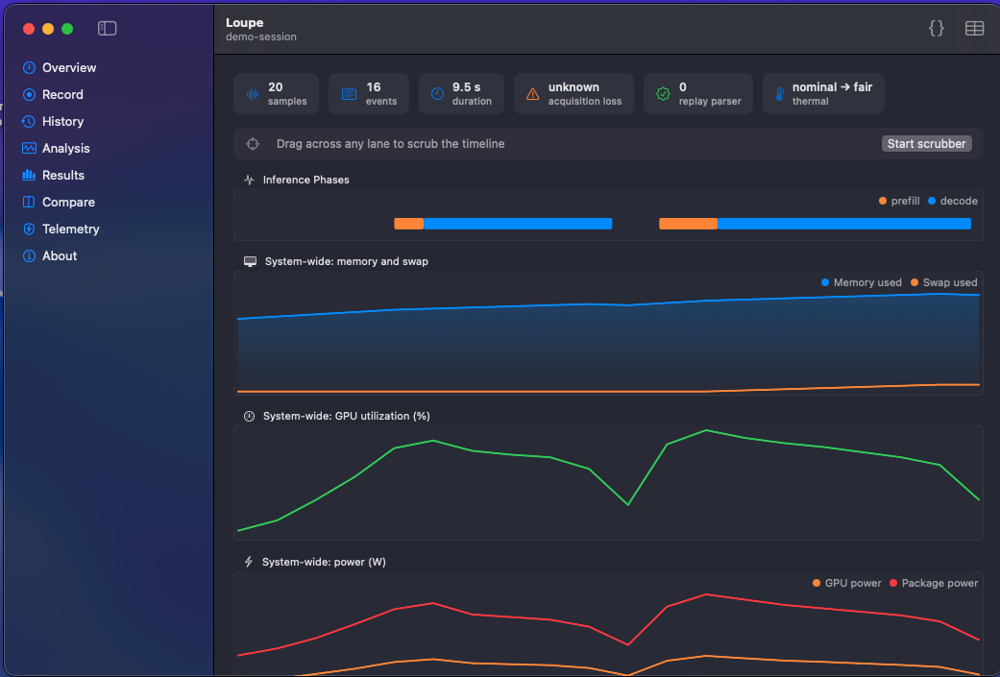
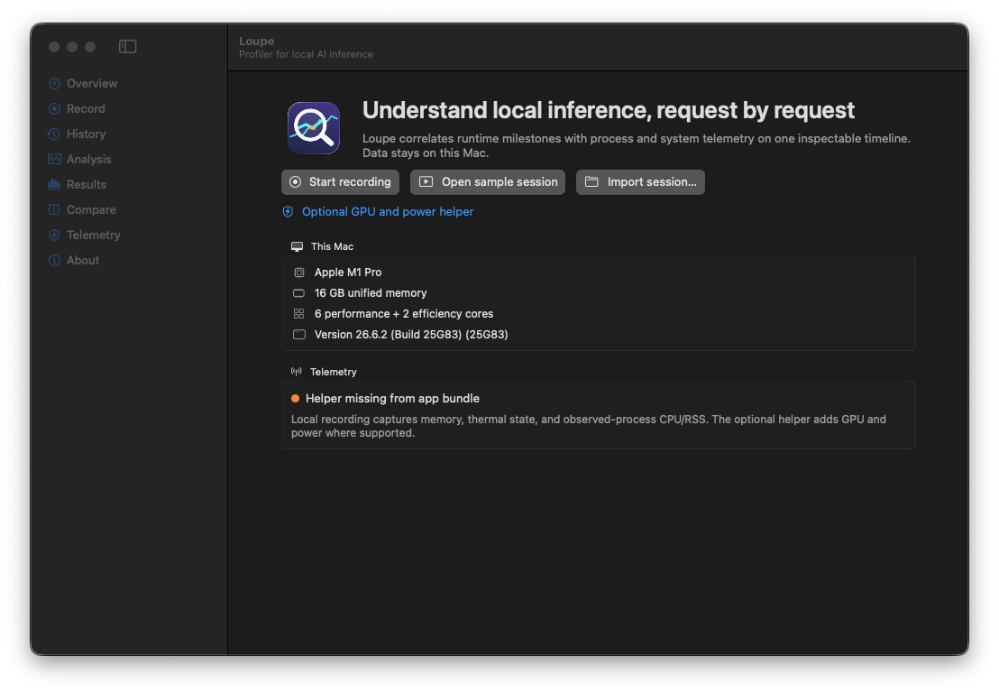
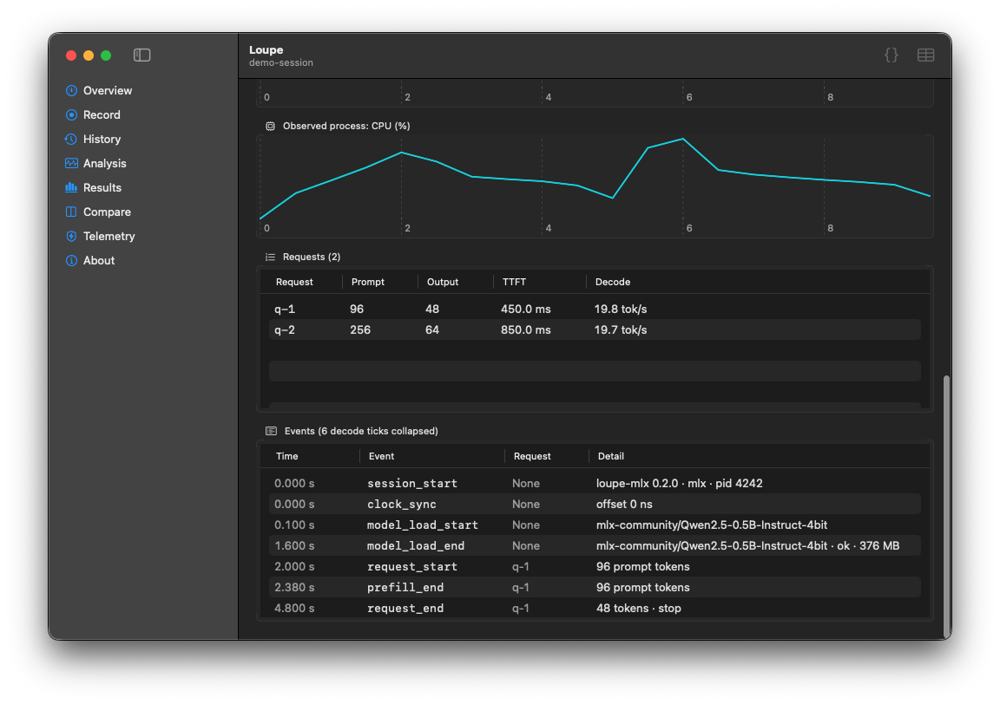

# Loupe

**See what happens during local AI inference.** Native macOS profiling for Apple Silicon.

[](https://github.com/ryouol/Loupe/actions/workflows/ci.yml)

[Three-minute demo](docs/DEMO.md) · [Engineering review guide](docs/ENGINEERING_REVIEW.md) · [Architecture](docs/ARCHITECTURE.md) · [Recording quickstart](docs/RECORDING_QUICKSTART.md)



*The bundled sanitized sample: two requests, 20 telemetry samples, and 16 runtime events.
These are replay visuals, not a live hardware benchmark. Acquisition loss is correctly
`unknown` because this historical sample lacks producer accounting metadata.*

## What you can inspect

| Question | Loupe view |
|---|---|
| Where did inference spend time? | Shared prefill/decode timeline and per-request time to first token (TTFT) |
| What changed while the model ran? | Separate system memory/swap, GPU/power, and process CPU/RSS lanes |
| Can I trust the trace? | Acquisition-loss accounting shown separately from replay-parser drops |
| Can someone else inspect the evidence? | Portable session files and JSON/CSV evidence with source SHA-256 hashes |

<details>
<summary>More screenshots: overview and request-level evidence</summary>



*Unsigned CI smoke build. The helper warning is visible; local replay requires no helper.*



*The same bundled sample shows 450 ms and 850 ms TTFT for its two requests.
See [capture provenance](docs/media/README.md) for the origin of each image.*

</details>

## How it works

Loupe is a local-first macOS profiler for Apple Silicon inference. It places
model load, prefill, decode, and provenance-typed memory events (including
modeled KV where defensible) on the same timeline as
process CPU/RSS and system memory, swap, thermal, GPU, and power telemetry.
Every finding links back to the samples and runtime events that support it.

Version 0.2 adds a complete in-app workflow: start and stop a recording,
connect a same-user MLX or llama.cpp adapter, recover durable session history,
open a bundled sanitized sample without a model or API key, and export hashed
JSON/CSV evidence.

Analysis keeps process CPU and RSS, GPU utilization, GPU power, package power,
memory, and swap in unit-correct lanes. Missing channels stay hidden. Recording
loss and replay-file corruption are shown separately: an exact count requires a
closed producer accounting window, while legacy or interrupted sessions show
`unknown` (with an observed lower bound when available), never an invented zero.

## Run the demo

The demo needs no model download, root helper, account, or API key. Building
from source requires **Apple Silicon, macOS 15+, and full Xcode 16+**; Command
Line Tools alone cannot build the app or run XCTest.

```bash
git clone https://github.com/ryouol/Loupe.git
cd Loupe
# Install these tools with Homebrew if they are not already available.
brew install xcodegen uv
make bootstrap
make replay
```

`make replay` builds an unsigned app and opens the bundled sample directly in
**Analysis**. On a normal app launch, choose **Open sample session** instead.
Follow the [three-minute walkthrough](docs/DEMO.md) for expected values,
scrubbing, and evidence export.

To validate the code:

```bash
make build
make test
# Additional tools used by make lint:
brew install swift-format actionlint shellcheck
make lint
```

Python dependencies resolve from `adapters/loupe-mlx/uv.lock`. Use uv 0.11.15
or newer (CI pins 0.12.8). Release verification also requires OSV-Scanner;
`make verify` audits both dependency lockfiles before packaging.

Reviewing without a local build? Start with the screenshots above, the
[engineering review guide](docs/ENGINEERING_REVIEW.md), and the
[successful baseline CI run](https://github.com/ryouol/Loupe/actions/runs/33529158114).
Its downloadable unsigned smoke artifact is for engineering evaluation;
artifact availability is subject to GitHub retention and sign-in requirements.

## Record a real run

1. Choose **Record** → **Start Recording**.
2. Copy the `LOUPE_SOCKET_PATH` and `LOUPE_RUN_ID` environment values shown by
   the app into the terminal that will run the adapter.
3. Run an instrumented workload. Loupe moves from waiting to recording after
   it validates `session_start` and verifies the observed PID belongs to the
   logged-in user.
4. Stop the recording and open it from **History**.

A completed protocol-v3 recording has runtime-event and telemetry NDJSON files
plus an acquisition-metadata JSON sidecar. JSON and CSV evidence identify and
SHA-256 hash every present source, and carry the same counts, duration, thermal
states, replay-parser drops, and acquisition-loss summary.

The root helper is optional. Local mode records memory, thermal state, and
per-process CPU/RSS; a correctly signed and approved helper can add privileged
GPU/power channels. Unsigned builds deliberately disable helper installation.

## Trust model

- Adapter ingest and all persistence run as the logged-in user, never root.
- Session filenames are opaque UUIDs; adapter-provided IDs never become paths.
- The Unix socket and session directory are owner-only, same-UID, bounded, and
  schema-strict.
- The root helper exposes telemetry only and accepts the active console user
  only when the app matches its runtime-derived signing team and bundle ID.
- The llama.cpp adapter refuses non-loopback servers, redirects, configured
  proxies, and embedded credentials so prompts are not sent remotely by
  accident.
- Built-in adapters have no prompt/generated-text event fields and sanitize
  generation failures, but user-provided session names and adapter metadata
  can still be sensitive.
- Loupe contains no analytics, account system, advertising SDK, or cloud
  upload path.

For copy-ready MLX and llama.cpp setup, version capture, model/KV provenance,
UI transitions, and recovery steps, see the
[recording quickstart](docs/RECORDING_QUICKSTART.md).

See [architecture](docs/ARCHITECTURE.md), [security](docs/SECURITY.md),
[privacy](docs/PRIVACY.md), and [launch readiness](docs/LAUNCH_READINESS.md).

## Uninstall and local data

Open **Telemetry** and choose **Uninstall** before removing the app if the
optional helper was approved. Quit Loupe, move `Loupe.app` to the Trash, and
delete sessions individually from **History**. For complete local-data removal,
move `~/Library/Application Support/Loupe` to the Trash. There is no cloud
account or server-side session copy to delete.

## Packaging status

`make dist` always names unsigned and signed-but-unnotarized images as
non-release artifacts. Only the signed, notarized, stapled path receives the
plain `Loupe-x.y.z.dmg` filename. No certificate or notarization result is
claimed by this repository. Owner-only release gates are documented in
[distribution.md](docs/distribution.md).

Copyright © 2026 Roy Luo. All rights reserved. See [LICENSE](LICENSE).
