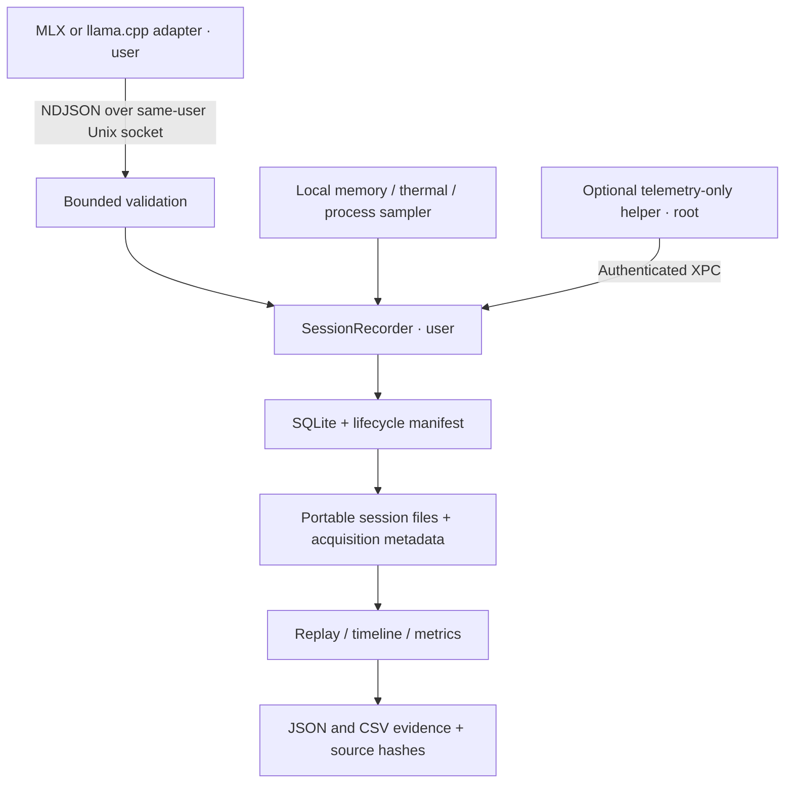

# Engineering review guide

Start with the [three-minute demo](DEMO.md), then trace one request through
validation, storage, replay, and evidence export. Loupe is a native SwiftUI
profiler with user-owned recording and an optional privileged telemetry helper.
This guide prepares a review; it does not claim an external review is complete.

## Suggested review order

| Time | Read | Focus |
|---|---|---|
| 5 min | [README](../README.md), [demo](DEMO.md) | Product behavior, expected fixture values, missing-data semantics |
| 10 min | [Architecture](ARCHITECTURE.md), [package graph](../Package.swift), [app project](../project.yml) | Ownership, dependencies, user/root boundary |
| 15 min | [Event contract](../protocol/events.schema.json), [decoder](../Sources/LoupeCore/Protocol/EventDecoder.swift), [socket server](../Sources/LoupeSampler/EventSocketServer.swift) | Untrusted input, bounds, identity, sequencing, loss accounting |
| 15 min | [Recorder](../Sources/LoupeStore/SessionRecording.swift), [event router](../Sources/LoupeStore/SessionEventRouter.swift), [store](../Sources/LoupeStore/SessionStore.swift) | Lifecycle, shutdown drain, interruption, durable recovery |
| 10 min | [Metrics](../Sources/LoupeCore/SessionMetrics.swift), [replay model](../Sources/LoupeApp/ReplayViewModel.swift), [evidence](../Sources/LoupeApp/SessionEvidence.swift) | Clock alignment, TTFT, signal units, source integrity |
| 5 min | [Security](SECURITY.md), [distribution](distribution.md), [launch readiness](LAUNCH_READINESS.md) | Remaining production and release gates |

## Data flow and privilege boundary



Adapters and session persistence remain outside the root helper. Validate the
actual dependency and source boundary with `scripts/check-helper-boundary.py`;
the diagram is a reading aid, not a substitute for the implementation.

## Invariants worth challenging

| Review question | Starting tests |
|---|---|
| Can malformed input, another UID, or an invalid event sequence enter a recording? | [EventSocketServerTests](../Tests/LoupeSamplerTests/EventSocketServerTests.swift), [EventCodecTests](../Tests/LoupeCoreTests/EventCodecTests.swift), [SessionEventRouterTests](../Tests/LoupeStoreTests/SessionEventRouterTests.swift) |
| Are shutdown, reconnect, backpressure, and acquisition loss accounted for honestly? | [SessionRecordingTests](../Tests/LoupeStoreTests/SessionRecordingTests.swift), [DaemonXPCTests](../Tests/LoupeSamplerTests/DaemonXPCTests.swift) |
| Are process and system signals kept distinct and clocks aligned? | [TimebaseTests](../Tests/LoupeCoreTests/TimebaseTests.swift), [TimelineTests](../Tests/LoupeAppTests/TimelineTests.swift) |
| Do metrics and findings retain defensible timing and memory provenance? | [Core tests](../Tests/LoupeCoreTests/LoupeCoreTests.swift), [AnnotationEngineTests](../Tests/LoupeCoreTests/AnnotationEngineTests.swift) |
| Do exports detect changed sources and escape spreadsheet formulas? | [App tests](../Tests/LoupeAppTests/LoupeAppTests.swift), [CSVFieldEncoderTests](../Tests/LoupeCoreTests/CSVFieldEncoderTests.swift) |
| Are comparisons rejected when benchmark provenance is incomplete? | [RunComparisonTests](../Tests/LoupeBenchTests/RunComparisonTests.swift), [ComparisonViewTests](../Tests/LoupeAppTests/ComparisonViewTests.swift) |

## Validation evidence

Baseline source: [`cc5d120`](https://github.com/ryouol/Loupe/commit/cc5d120b7ada850e4ce2f26850a6c855dfc76f66).
Evidence checked September 12, 2026. This review package changes documentation
and media only; use the PR checks for validation of the documentation commit.

| Check | Evidence / result |
|---|---|
| Baseline GitHub CI | [Run 33529158114](https://github.com/ryouol/Loupe/actions/runs/33529158114), succeeded September 1, 2026 |
| Swift XCTest in that run | 224 tests executed, 3 skipped, 0 failures |
| Python in that run | 63 passed, 1 skipped |
| Build, lint, dependency audits, sample validation, unsigned packaging | Passed in that same CI run |
| Local Python rerun for this review package | 63 passed, 1 skipped |
| Local `make test` | Blocked at `no such module 'XCTest'`; selected developer directory is Command Line Tools |
| Native screenshots | Captured/reused from real app windows; individual origins in [media notes](media/README.md) |

A green unsigned smoke build is not a signed or notarized release. Hardware
and optional tests skipped by CI remain outside its passing evidence. The
older workspace-only limitations in [launch readiness](LAUNCH_READINESS.md)
are historical; CI above provides subsequent full-Xcode evidence without
resolving signing, notarization, or the supported-hardware matrix.

## Reproduce locally

Use the prerequisites and bootstrap steps in the [README](../README.md#run-the-demo).
Then run these from the repository root:

```bash
make build
make test
make lint
.venv/bin/python scripts/validate-sample.py
.venv/bin/python scripts/check-helper-boundary.py
```

If `xcodebuild -version` reports Command Line Tools, select a full Xcode
installation in Xcode's Settings → Locations → Command Line Tools, then retry.
Do not treat parse-only validation as a substitute for XCTest.

## Scope and remaining questions

- The bundled demo is sanitized historical v1 data. Review current v3 ingest
  with its tests and a deliberate new recording, not by extrapolating from it.
- GPU utilization and package power are system-wide; runtime memory proxies
  and modeled KV are not interchangeable with measured KV.
- Unsigned builds cannot establish the production helper signing identity.
  Signed-client allow/deny tests and multi-user behavior require a suitable setup.
- IOReport channel availability and performance need supported M-series hardware.
- Signing, notarization, external security review, and commercial/legal gates
  remain separate from this source-review handoff.

Record findings with the source path, concrete failure scenario, expected
behavior, and a reproduction or test. No reviewer has been assigned or notified
by this documentation change.
