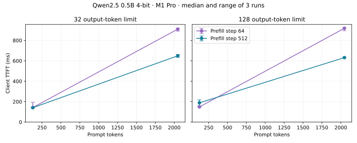

# Prefill chunk sizing on a 16 GB M1 Pro

**Finding:** for the fixed 2,048-token prompt / 128-output-token workload, increasing MLX prefill chunks from 64 to 512 tokens reduced median client TTFT from **918.55 ms to 631.56 ms (31.2%)**. Median request duration fell from **1,570.58 ms to 1,285.11 ms (18.2%)**. These are three repeated local synthetic requests per configuration, not a production or broad-model speedup.

## Measurement

Evidence: [`benchmarks/2026-09-16-validation`](../../benchmarks/2026-09-16-validation). Qwen2.5-0.5B-Instruct-4bit revision `a5339a4131f135d0fdc6a5c8b5bbed2753bbe0f3`; MLX 0.32.2 / mlx-lm 0.31.3. Exact OS, library versions, source and model hashes are in `manifest.json`. The model stayed resident; every request used a fresh KV cache. Greedy decoding and tokenized synthetic prompts were held constant. Each condition had one warmup; three measured repeats alternated step order. An earlier exploratory capture is retained separately; headline values use the final validation capture, run without the WLA load matrix.

| Prompt tokens | Output limit | TTFT, step 64 | TTFT, step 512 | Total, step 64 | Total, step 512 |
|---:|---:|---:|---:|---:|---:|
| 128 | 32 | 142.74 ms | 141.04 ms | 279.55 ms | 275.74 ms |
| 128 | 128 | 148.49 ms | 188.71 ms | 690.86 ms | 730.74 ms |
| 2,048 | 32 | 910.54 ms | 649.47 ms | 1,083.69 ms | 813.17 ms |
| 2,048 | 128 | 918.55 ms | 631.56 ms | 1,570.58 ms | 1,285.11 ms |

All cells are medians of three runs. `summary.json` retains min/max; no tail-percentile claim is warranted. The short-prompt / 128-output condition regressed, so this is **not** a recommendation to change a global runtime default. Both tested chunk sizes are experimental settings, not claims about mlx-lm's default.

## Diagnosis and intervention

Loupe's event stream places the major long-context difference before the first generated token. The host cProfile capture (`host-profile.txt`, with `host.pstats` for inspection) spends most cumulative time in mlx-lm generation. Inspecting the pinned implementation shows its prefill loop evaluates the model/cache and clears the allocator cache at each chunk. Processing the first 2,047 prompt tokens takes 32 chunks at size 64 versus four at size 512. Larger chunks reduce repeated prefill passes; that controlled setting change is the intervention. The profile is a host call profile and does not isolate GPU kernels or prove a memory-bandwidth bottleneck.

Output token-ID hashes match across both chunk sizes and all repeats for each workload. This verifies the observed outputs were unchanged here; it is not an accuracy benchmark or a guarantee of determinism for other models. Peak allocator memory is retained per request rather than presented as measured KV-cache usage.

## Integrity checks and limitations

- 38 traced requests include warmups, measured runs, overhead controls, profiling and one deliberate cancellation. All client/event timing inequalities and token counts passed.
- The native replay exported 37 completed requests, excluded the cancellation, and agreed with Python on every exported TTFT. Zero event/telemetry parser drops; the terminal event reports zero producer drops and event sequence numbers are contiguous.
- 345 real system samples were recorded; all observed thermal states were nominal. System GPU/power signals are not per-process attribution. The machine had nonzero existing swap use; results apply to this recorded machine state.
- Paired instrumented/uninstrumented total-duration medians were 671.52/673.89 ms. Three noisy pairs do not resolve instrumentation overhead: the negative apparent difference is **not** an instrumentation speedup. Per-event file flush costs remain inside instrumented requests.
- TTFT here is first generated-token receipt, even if its decoded text segment is empty. `client_text_ttft_ms` separately records first nonempty text. Consumer timestamps enclose the adapter's measured boundaries.
- An implementation bug found during this work allowed cancelled/error terminal requests into successful request metrics. LoupeCore now restricts completion metrics to `stop`, `length`, or `eos`; regression tests retain incomplete/cancelled evidence without counting it as success.

## Interview explanation

“I used Loupe to separate prefill from decode on a pinned local MLX model. Long-prompt TTFT changed strongly with prefill chunk size. I checked the host profile and runtime loop, changed only the chunk size, and repeated the experiment with the same prompts and greedy outputs. At 2,048 input / 128 output tokens, median TTFT fell 31.2%, with identical token sequences. Short prompts did not consistently improve, and I cannot claim a GPU-kernel optimization or serving throughput improvement.”

This is an engineering explanation of the saved experiment. Roy should reproduce and understand it before presenting it as personally performed work.
